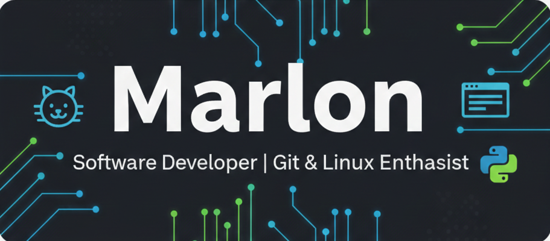

# ¡Hola, soy Marlon! 👋

Estoy iniciando mi camino en el desarrollo de software.

## 🚀 Sobre mí
- 📍 Vivo en **Colombia**.
- 💻 Actualmente aprendiendo a dominar la **Terminal de Linux** y **Git**.
- 📚 Me enfoco en construir bases sólidas antes de saltar a mi primer lenguaje.

## 🎯 Mis metas actuales
1. Dominar el flujo de trabajo en la terminal.
2. Mantener mis repositorios organizados.
3. Aprender la lógica detrás del código.
## 🎯 Mis Objetivos Técnicos:

**Lenguajes de Marcado y Estilos:**

**Lenguajes de Programación:**

